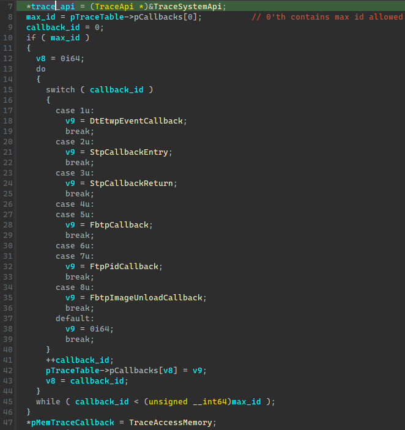
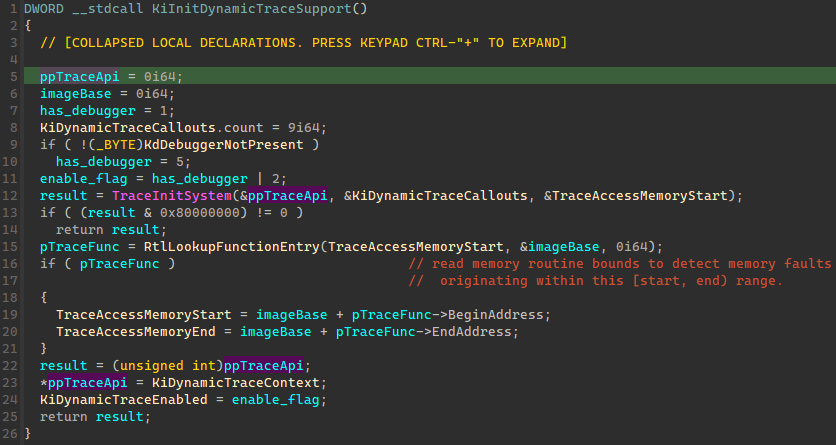
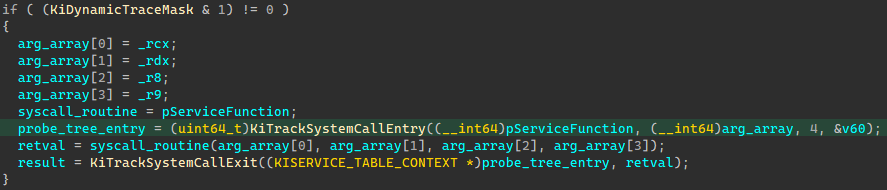

# STrace: A Dtrace-on-Windows Reimplementation
### By Stephen Eckels (@stevemk14ebr)

For the past few months I have been reversing, on my own time, the windows kernel interfaces to the DTrace system on Windows. For those not familiar, DTrace is a historically Unix dynamic tracing tool used to explore system and process information. Here is the wikipedia blurb:

```
DTrace is a comprehensive dynamic tracing framework originally created by Sun Microsystems for troubleshooting kernel and application problems on production systems in real time. Originally developed for Solaris, it has since been released under the free Common Development and Distribution License (CDDL) in OpenSolaris and its descendant illumos, and has been ported to several other Unix-like systems. 
```

As of late 2019/2020 wikipedia probably should have included Windows into that list of operating systems it's been ported to. Microsoft undertook the work to port [OpenDTrace](https://github.com/opendtrace) to windows, and even open sourced a large portion of the usermode components for their port [Partial Open Source Implementation](https://github.com/microsoft/DTrace-on-Windows/tree/master). I say partial because much of the code in repository is either incomplete or incorrect compared to the current binary distribution. Because of this unfortunate reality using this port is difficult and hard to troubleshoot. Frustrated, angry, but impressed with DTrace's potential, I reverse engineered the port and reimplemented my own version of DTrace for windows, this will be that story, with the reimplementation living here: [STrace GitHub](https://github.com/stevemk14ebr/STrace). 

## Prior Work
As should be standard, prior work, credits, and references first.
* @JonasLyk for pointing me at DTrace and discussing its issues with me
* [Orguz Kartal's Post](https://www.oguzkartal.net/blog/index.php/2019/08/26/intercepting-the-windows-10-system-service-call-using-the-weakness-caused-by-the-dynamic-trace-support/)
* [Alex Ionescu's Post](https://www.alex-ionescu.com/?p=358)
* [MS Blog One](https://techcommunity.microsoft.com/t5/windows-kernel-internals/dtrace-on-windows/ba-p/362902)
* [MS Blog Two](https://techcommunity.microsoft.com/t5/windows-kernel-internals/dtrace-on-windows-20h1-updates/ba-p/1127929)
* [DTrace Language Documentation](https://illumos.org/books/dtrace/chp-actsub.html)
* [Rust Kernel Driver Example](https://github.com/pravic/winapi-kmd-rs)
* [Rust Kernel Driver Blog](https://not-matthias.github.io/kernel-driver-with-rust/)
* [Process Explorer StackTrace](https://blog.airesoft.co.uk/2009/02/grabbing-kernel-thread-call-stacks-the-process-explorer-way-part-3/)
* [Process Hacker StackTrace](https://github.com/processhacker/processhacker/blob/3cd4b4ab5e7ca7f10d070c9d0f60b7e05b5f2210/KProcessHacker/thread.c#L339)

# Architecture of the DTrace System

If you go to the microsoft blog you will see this diagram


Although accurate once upon a time, this is no longer how the dtrace system is architected, but we'll get to that. The system is simple in concept, a usermode component accepts a user written script in the language called DLang (not D the 'modern' language), that script then registers a set of 'probes' with the help of a driver. Each probe is like a built-in callback that triggers when some set of conditions is met. The user can perform very limited logic in these routines such as logging, reading/writing memory, or dumping processes. Loops, functions, and wide string support does not exist, the language is very limited. The script is executed via an interpreter / virtual machine inside the driver component. A kernel component fires events to the driver, which then interprets these events and executes the scripted user probe logic. 

Here is an example DTrace script to log the NtCreateFile syscall. The script is extremely verbose due to limitations of the system such as no user defined functions, loops, etc:
```
BEGIN {
    FILE_DISPOSITION[0] = "SUPERSEED"; FILE_DISPOSITION[1] = "OPEN"; FILE_DISPOSITION[2] = "CREATE"; FILE_DISPOSITION[3] = "OPEN_IF"; FILE_DISPOSITION[4] = "OVERWRITE"; FILE_DISPOSITION[5] = "OVERWRITE_IF"; FILE_DISPOSITION_MAX_IDX = 5;
}

syscall::NtCreateFile:entry
/ pid == $target && arg0 != 0 && arg2 !=0 /
{
    this->access = "|"; 
    this->access = strjoin(this->access, (arg1 & FILE_READ_DATA) ? "ReadData|": "" ); 
    this->access = strjoin(this->access, (arg1 & FILE_WRITE_DATA) ? "WriteData|": "" );
    this->access = strjoin(this->access, (arg1 & FILE_APPEND_DATA) ? "AppendData|": "" );
    this->access = strjoin(this->access, (arg1 & FILE_READ_EA) ? "ReadEa|": "" );
    this->access = strjoin(this->access, (arg1 & FILE_WRITE_EA) ? "WriteEa|": "" );
    this->access = strjoin(this->access, (arg1 & FILE_EXECUTE) ? "Execute|": "" );
    this->access = strjoin(this->access, (arg1 & FILE_DELETE_CHILD) ? "DeleteChild|": "" );
    this->access = strjoin(this->access, (arg1 & FILE_READ_ATTRIBUTES) ? "ReadAttributes|": "" );
    this->access = strjoin(this->access, (arg1 & FILE_WRITE_ATTRIBUTES) ? "WriteAttributes|": "" );
	  this->disposition = "|"; 
    this->disposition = ((uint32_t)arg7) <= FILE_DISPOSITION_MAX_IDX ? FILE_DISPOSITION[((uint32_t)arg7)] : "INVALID_DISPOSITION";
	
	  this->fname = (*(fileInfo*)alloca(sizeof(fileInfo)));
    attr = (OBJECT_ATTRIBUTES*)copyin(arg2, sizeof(OBJECT_ATTRIBUTES));
    if(attr) { objectName = (UNICODE_STRING*)copyin((uintptr_t)attr->ObjectName, sizeof(UNICODE_STRING));
      this->fname.len = objectName->Length;
      if (objectName) { 
        this->fname.str = *((ustr*)copyin((uintptr_t)objectName->Buffer, ((sizeof(ustr)) > ((this->fname.len ? this->fname.len / 2 : 0) * 2) ? ((this->fname.len ? this->fname.len / 2 : 0) * 2) : (sizeof(ustr))))); this->fname.str.buffer[(this->fname.len ? this->fname.len / 2 : 0)] = 0; 
        this->fname.attributes = "|";
        this->fname.attributes = strjoin(this->fname.attributes, (attr->Attributes & OBJ_INHERIT) ? "Inherit|": "" );
        this->fname.attributes = strjoin(this->fname.attributes, (attr->Attributes & OBJ_EXCLUSIVE) ? "Exclusive|": "" );
        this->fname.attributes = strjoin(this->fname.attributes, (attr->Attributes & OBJ_CASE_INSENSITIVE) ? "CaseInsensitive|": "" );
        this->fname.attributes = strjoin(this->fname.attributes, (attr->Attributes & OBJ_OPENIF) ? "OpenIf|": "" );
        this->fname.attributes = strjoin(this->fname.attributes, (attr->Attributes & OBJ_OPENLINK) ? "OpenLink|": "" );
        this->fname.attributes = strjoin(this->fname.attributes, (attr->Attributes & OBJ_KERNEL_HANDLE) ? "KernelHandle|": "" );
        this->fname.attributes = strjoin(this->fname.attributes, (attr->Attributes & OBJ_FORCE_ACCESS_CHECK) ? "ForceAccessCheck|": "" );
        this->fname.attributes = strjoin(this->fname.attributes, (attr->Attributes & OBJ_IGNORE_IMPERSONATED_DEVICEMAP) ? "ImpersonateDeviceMap|": "" );
        this->fname.attributes = strjoin(this->fname.attributes, (attr->Attributes & OBJ_PERMANENT) ? "Permanent|": "" );
        this->fname.attributes = strjoin(this->fname.attributes, (attr->Attributes & OBJ_DONT_REPARSE) ? "DontReparse|": "" ); 
      } 
    }
}

syscall::NtCreateFile:return
/ pid == $target /
{
	printf("%s -> %s(0x%x)\n", execname, probefunc, arg0);
	printf("    DISPOSITION %s\n", this->disposition); 
	printf("    ACCESS_MASK %s\n", this->access);
	printf("    OBJECT_NAME %ws (%d)\n", this->fname.str.buffer, this->fname.len);
	printf("    ATTRIBUTES  %s\n", this->fname.attributes);
	ustack();
}
```

The driver executes at a very high IRQL (15) during script execution in the VM, for an unknown reason. Due to this high IRQL, memory accesses in the kernel will blue screen of death (BSOD) when paged out memory is touched as the paging exception cannot be handled at this high level. To accomodate for this the DTrace language invented the routine ```copyin``` which gracefully fails accessing memory that may be paged out. This routine cannot read or pagein memory that is paged out, instead it will fail gracefully rather than BSOD. This constraint is why Microsoft recommends reading arguments in the return probes, after the service routine pages them in, since the service routines execute at a lower IRQL (IRQL 15-entry probe -> IRQL LOW_LEVEL-service routine -> IRQL 15-return probe). This is not done in the script I showed above, and we do in fact see memory faults in some cases when trying to access paged out memory. We'll discuss how DTrace accomplishes safely recorvering from these page faults at such a high IRQL later, as it's not typically possible to implement safe access to invalid memory in this way. Because of this memory access limitation every routine that DTrace uses to touch memory must use their 'safe' memory routine, so many features like stackwalking have been re-implemented rather than using more common existing interfaces or kernel APIs. It's clear the DTrace team had some interaction with the larger kernel team at Microsoft to support the needs of this tracing system.

## Modern DTrace
As part of their 20H1 updates the DTrace system was re-designed by Microsoft. The largest change was removal of the entire ```Traceext.sys``` driver. This changed how the driver registers itself with the kernel and the interactions that occur. The FBT Probe provider was also changed from int 3 + Attached kernel debugger to a hypervisor based solution. Rather than an external debugger handling breakpoints, windows on hypervisor handles the faults and sort of debugs it's own kernel, very neat actually but the details of that are out of scope of this article. Important to us is understanding that this doesn't actually put the dependency of virtualization support on the 20H1 DTrace to operate in its entirety, only FBT probes require hypervisor virtualization support. This is important because the probe type I will be discussing, the syscall probe (Stp - system trace probe), can operate on a bare bones modern window installation without nested virtualization support or hypervisor based features enabled, despite what the official documents suggests. The earliest build of windows I could identify the modern DTrace kernel interfaces on was 1940. I'll now discuss how the driver boots and then eventually registers with the kernel tracing interfaces in its modern implementation.

## Booting DTrace
DTrace loading starts at the bootloader. The executable ```winload.exe``` contains a check for the boot flag ```dtrace```. 
```
bcdedit /set dtrace on
```

Controls this flag. If set, the loader will attempt to resolve the api-scheme-set-extension registration entry ```ext-ms-win-ntos-trace-l1-1-0```. For those unfamiliar with schema sets, these are 'virtual' DLLs that you can basically think of like aliases or symlinks to real, implementation DLLs. In this case, this schema set DLL internally identifies itself as an alias for ```dtrace.sys```. For the bootloader to find this schema set entry extension a special file must exist within the system32 folder, and the following registry entries must be in place:

```
HKEY_LOCAL_MACHINE\SYSTEM\CurrentControlSet\Control\Session Manager\ApiSetSchemaExtensions\<anything>\FileName=<schema_set_dll.dll>

HKEY_LOCAL_MACHINE\SYSTEM\CurrentControlSet\Control\Session Manager\ApiSetSchemaExtensions\<anything>\Name=<anything>
```

The FileName is the name of the file placed in the system32 folder. This file must have a valid certificate and a DLL section named ```.apiset``` with a binary HashTable entry that points ```ext-ms-win-ntos-trace-l1-1-0``` to ```dtrace.sys```. If this is present then the bootloader will copy the ```.apiset``` section into its apiset registration list. If we now shift our focus over to ```ntoskrnl.exe``` we can see that it imports a single function from this schema set DLL, ```TraceInitSystem```.


This import is a registration routine that ties the dtracer driver to the kernel by filling out function pointer tables. This routine is invoked early in the load process, in ```KiInitDynamicTraceSupport```, itself called by ```KeInitSystem``` during system phase 1 initialization. This initialization routine is run early so that the tables that it fills out with dynamic function pointers can be protected by patchguard when done. After the initialization routine and then later patchguard are done with their work the system boots normally. Note that because this driver is loaded extremely early, code execution before patchguard initialization can be achieved inside of `TraceInitSystem`, and as developers we can register our own trace apis into these dynamic tables which will be protected by patchguard after boot completes. This is not a security vulnerability as the placement of the API set DLL and driver files requires adminstrator access to the machine and a device reboot, Microsoft does not consider having adminstrator priviledges a security boundary to the kernel. After booting, the dtrace driver launches as an automatic start service to create the driver device objects and other setup necessary for usermode communications and operation. 

## TraceInitSystem - Registering to the kernel
When invoked this routine will fillout a table called ```KiDynamicTraceCallouts```, provide a routine for 'safe' memory accesses called ```TraceAccessMemory```, and provide a pointer that the kernel will fill to point at an API list ```KiDynamicTraceContext```. 



The trace callouts table is a set of callbacks that the kernel is responsible for calling when certain probe events fire, for example system call entry and return. The ```dtrace.sys``` driver fills the entries responsible for syscall tracing with ```StpCallbackEntry``` and ```StpCallbackReturn```, other probe type callbacks such as `Fbt` probes are also registered but I will not discuss them in this article. The memory routine provided to the kernel by the dtrace driver is a special routine the kernel uses to perform unsafe reads on potentially paged out memory or otherwise innaccessible memory. This is what ```copyin``` and some other routines use to touch memory. This routine has a ```__try __except``` block around it to force the compiler to generate unwind information which the kernel reads via ```RtlLookupFunctionEntry``` to locate the start and end addresses of the function. Using these function bounds the kernel memory fault handler ```MmAccessFault``` contains a special case to invoke the routine ```KeInvalidAccessAllowed``` which then calls ```KiIsTraceMemoryAccess``` to determine if a memory exception was within the special access routine. If the exception is within the access routine there is logic in `ntoskrnl` to return an access violation code rather than a bugcheck and execution continues as normal. The conditions within ```KiIsTraceMemoryAccess``` require an IRQL of 15 and the boundary globals of the memory access routine to be filled, we'll discuss the IRQL requirement later. Without the support of the kernel team, it would not have been possible to support unsafe memory accesses to paged or inaccessible memory for these tracing APIs.



```KiDynamicTraceContext``` is a global API pointer list within the kernel that provides metadata about kernel offsets and APIs to performing tracing tasks. Here is the reversed structure:

```
ntoskrnl!KiDynamicTraceContext
struct TraceApi
{
  ULONG32 supported_flags;
  ULONG32 kthread_tracingprivatedata_offset;
  ULONG32 kthread_tracingprivatedata_arraysize;
  ULONG32 kthread_trapframe_offset;
  ULONG64 kthread_teb_offset;

  NTSTATUS(*KeSetSystemServiceCallback)(const char *syscallName, BOOLEAN isEntry, ULONG64 callback, ULONG64 probeId);
  void *KeSetTracepoint;
  void *EtwRegisterEventCallback;
  void *PsGetBaseTrapFrame;
  void *KiGetTrapFrameRegister;
  void *MmEnumerateSystemImages;
};
```

Offsets to the `TEB` and other kernel members are given so that the dtrace driver can be generic across windows versions. As the kernel versions increase these metadata fields are adjusted and the driver always uses correct values. I not know what the tracingprivatedata holds. As part of the initialization process ```KiDynamicTraceEnabled``` is set as a sort of 'what is enabled bitfield. I don't know all these values in detail but Oguz Kartal notes the following values and they do seem accurate:

```
1: DTrace enabled
2: DTrace initialized
4: Kernel Debugger present
```

The routine ```KeSetSystemServiceCallback``` is of core interest for tracing system calls. When used by a driver that has completed the trace initialization and registration procedure mentioned above, callbacks can be registered by syscall function name on entry and exit with full access to all parameters and return value. 

## KeSetSystemServiceCallback - Registering callbacks

To register either an entry or return callback to a system call this routine accepts the name of a syscall without a prefix, a boolean to specify if it's an entry or return registration, a callback function pointer which must match one of the pointers provided to ```KiDynamicTraceCallouts```, and a metadata probe ID chosen arbitrarily by the user as a handle. The syscall name must be provided without the first two characters of the syscall, omitting the common ```Zw``` or ```Nt``` prefix. To unregister a probe the same arguments should be used as in registration except the last two arguments ```callback``` and ```probeId``` should be zero. After successfully registering a syscall callback the kernel will transition from ```KiSystemCall64``` to first ```KiTrackSystemCallEntry```. This routine will compare the service routines pointer to a tree, then if a callback is registered for that syscall, will invoke the callback registered for syscall entry in the ```KiDynamicTraceCallouts``` table. The arguments passed to this routine will be discussed later. After calling the entry callback ```KiTrackSystemCallEntry``` returns and the system service routine is executed as normal with the return value is recorded. ```KiTrackSystemCallExit``` is then executed and passed the captured return value, as well as the tree node found during the entry routine which is used to directly check if a return callback is registered without traversing the callback tree again. If a return probe is enabled on the tree node the return entry in the ```KiDynamicTraceCallouts``` is executed. Then ```KiTrackSystemCallExit``` returns and ```KiSystemCall64``` completes as normal. Because the entry and return callbacks are checked on the usermode to kernel boundary function ```KiSystemCall64``` this design can only track usermode programs as they execute system calls such as through ntdll or manually. Zw style driver apis can be traced as well as they go through ```KiServiceInternal``` which shareds the same code path to the tracing logic inside ```KiSystemCall64```



Pseudocode of this dispatch:
```
KiSystemCall64(syscallIdx) {
   pService = LookupServiceRoutineFromSSDT_SSSDT(syscallIdx);
   // ...

   if(KiDynamicTraceMask & DTRACE_ENABLED) {
     machineContext = SnapShotArgAndStack();
     TreeEntry = KiTrackSystemCallEntry(pService, machineContext);
     return_value = pService(machineContext);
     KiTrackSystemCallExit(TreeEntry, return_value);
   }

   // ... 
   return return_value;
}
```

The kernel takes the service routine pointer and looks it up in a hardcoded table that maps the service pointer to the hash of the service name. If the tree node of this lookup has a user-registed probe registered, then it is fired. This table can be located inside of ```KiGetSystemServiceTraceTable``` or as the symbol ```KiServicesTab```.

## StpCallbackEntry - Handling a syscall entry callback

This is the routine registered in the syscall entry slot of the table ```KiDynamicTraceCallouts```. When executed by the kernel this routine receives the following arguments:
```
pService: Pointer to system service from SSDT/SSSDT
probeId: Identifier given in KeSetSystemServiceCallback for this syscall callback
paramCount: Number of arguments this system service uses
pArgs: Argument array, usually x64 fastcall registers rcx, rdx, r8, r9
pArgSize: Length of argument array, usually hard coded to 4
pStackArgs: Pointer to stack area containing the rest of the arguments, if any

void StpCallbackEntry(ULONG64 pService, ULONG32 probeId, ULONG32 paramCount, ULONG64* pArgs, ULONG32 pArgSize, void* pStackArgs)
```

The routine receives from the kernel metadata that describes the number of parameters the system call of that version of windows uses and then a captured array of both register and stack arguments to read those parameters. The stack array starts at the first stack argument and does not descend to potentially spilled register argument shadow space. Arbitrary logic at PASSIVE_LEVEL may be executed to handle the syscall entry. Dtrace.sys rather hilariously raises the IRQL to 15 immediately and then enters the ```DIF VM``` or D-lang intermediate format virtual machine. This VM executes user scripts sent from usermode to handle the event and read parameters and such. This high IRQL is potentially to help the VM execute without being interrupted, and maybe help with system performance, but it has some really unpleasant side effects of requiring user scripts to deal with potentially paged out memory and necessitating entirely custom routines like ```TraceAccessMemory``` to safely access this memory without blue screens. DTrace even contains a custom stack walk that exclusively uses ```TraceAccessMemory``` as a sort read memory api to walk unknown kernel addresses without acquiring any Mdls first (which cannot be done due to the high IRQL being acquired already). This is essentially equivalent to the following in usermode:

```
bool safe_memcpy(const void* dest, const void* src, size_t size)
{
    __try {
        memcpy((void*)dest, src, size);
    } __except(1) {
		    return false;
    }
	  return true;
}
```

## StpCallbackReturn - Handling a syscall return callback

This is the routine registered in the syscall return slot of the table ```KiDynamicTraceCallouts```. When executed by the kernel this routine receives the following arguments:

```
pService: Pointer to system service from SSDT/SSSDT
probeId: Identifier given in KeSetSystemServiceCallback for this syscall callback
paramCount: Number of arguments this system service uses, usually hard coded to 1
pArgs: Argument array, usually a single entry that holds return value
pArgSize: Length of argument array, usually hard coded to 1
pStackArgs: Pointer to stack area containing the rest of the arguments, if any

void StpCallbackReturn(ULONG64 pService, ULONG64 probeId, ULONG paramCount, ULONG64 *pArgs, ULONG pArgSize, void* pStackArgs)
```

The arguments are nearly identical to the entry probe except that the argument array is reused to hold a single entry for the return value. The arguments arrays are likely all dangling pointers at this time as the original system service routine was executed just previously, and so should not be used or read at all. Again the same rules apply, arbitrary logic to handle the callback at PASSIVE_LEVEL may be run. 

# STrace - DTrace syscall hook reimplementation

To reimplement DTrace we first need to load and register the same way DTrace does. This is actually fairly simple. First, the signed apiset dll shipped with the dtrace installer must be placed into ```%windir%\system32\```, under any filename, and then a driver named ```dtrace.sys``` into ```%windir%\system32\drivers\```. The apiset dll dictates the driver name since the resolution involves the dll/sys file path, which cannot be modified without breaking the digital signature. This is a bit sad honestly, the dtrace kernel API forbids entirely custom driver names so any reimplementation will always have references to dtrace if it wants to use the kernel trace APIs. What's nice however is that the driver that is loaded only has to pass the typical driver load signatures. For testing disabling driver signature enforcement allows us to load an entirely custom dtrace.sys. Patchguard is still enabled with DSE off. Some registry entries must also be set for the apiset dll and for the driver main to execute as a service to handle IOCTLs. After loading the custom driver the kernel will try to call ```TraceInitSystem``` which must mimic the registration that the original dtrace would do, but is free to pass its own callbacks for entry and return probes. Then using  ```KeSetSystemServiceCallback``` we can set or remove arbitrary entry or return probes at runtime. Unlike the dtrace implementation a reimplementation isn't retricted to using a VM to handle the callback logic and my own reimplementation doesn't use on. The high IRQL dtrace acquires is also unecessary and should be avoided to widen the set of allowed APIs.

Things start to get tricky when deciding how to allow users to upload code to handle the probe callbacks. The handler logic could be hardcoded into the driver itself, but this would require the driver to be re-compiled and the system rebooted every time the handling logic changes - which is often if you're an analyst. DTrace used a custom VM, we could also implement a custom language but we'd need a compiler and would have to write a whole interpreter, that's not that fun. I made some mistakes here in choosing the correct approach for STrace, but the final results are pretty neat. In the end I impelmented this entire system twice, once in Rust with web assembly (WASM) and then in C with a manual mapper to map freestanding DLLs into kernel memory.

## Rust Drivers and Web Assembly

Writing windows drivers in Rust is difficult, tedious, and not an experience I would recommend. It's cool though. I ran into multiple issues during this process, the first of which is that specifying to Rust the correct kernel libraries to link requires a custom build.rs script. Luckily `@not-matthias` already wrote one and shared it in his blog, so I was able to use this without issue. The next issue is that rust in no-std doesn't build without unwind machinery correctly. When operating in in kernel mode none of the normal unwind features are present, so a Rust driver should set panic = "abort" so that exceptions of any kind immediately fault instead of looking for unwind handlers. The rust system provides the ability to set this via the Cargo.toml build profile:

```
[profile.dev]
panic = "abort"
lto = "thin"
opt-level = 0
debug = 2
debug-assertions = true

[profile.release]
panic = "abort"
lto = "thin"
opt-level = 2
debug = 2
debug-assertions = true
```

Unfortunately, even with this set during linking the unwind symbol `__CxxFrameHandler3` is still referenced and fails to link:
```
error LNK2001: unresolved external symbol __CxxFrameHandler3
```

I was unable to resolve this. There are other symbols like this such as `__chkstk` too, the rust build system seems incapable of generating completely free standing binaries at the moment. To hack around this, I defined empty symbols instead to get past linking, but any routine that calls these will fail silently which is not great:

```
#[no_mangle] extern "C" fn __chkstk () {}
#[no_mangle] extern "C" fn __CxxFrameHandler3 () {}
```

I also ran into an internal compiler error (ICE) or two during this process, not fun. The next issue is that Microsoft doesn't provide any Rust API definitions for the kernel APIs. This is a _huge_ barrier for driver authors. Each and every API must be looked up, the type definition validated, then ported to a rust definition _including_ any structures used in the type. Here's an example:

```
extern "system"
{
	fn IoCompleteRequest(Irp: PIRP, PriorityBoost: IO_PRIORITY::KPRIORITY_BOOST);
}

#[repr(C)]
pub struct IRP
{
	pub Type: u16,
	pub Size: u16,
	/// Pointer to an `MDL` describing a user buffer, if the driver is using direct I/O.
	pub MdlAddress: PVOID,
	/// Flags word - used to remember various flags.
	pub Flags: u32,
	/// Pointer to a system-space buffer if the driver is using buffered I/O.
	pub SystemBuffer: PVOID,
	pub ThreadListEntry: LIST_ENTRY,
	/// I/O status - final status of operation.
	pub IoStatus: IO_STATUS_BLOCK,
  
  // ... truncated ...
}
```

This is terrible really, and is prone to mistakes if even one struct member is misaligned or ported incorrectly. Some types are also not easy to port, as the kernel uses features like anonymous unions and structures, which Rust doesn't have at all! Moving past these issues with APIs, rust itself has idiosyncracies with no_std too. For example to manage strings one might think they could use the normal CStr rust APIs once an allocator is defined, unfortunately you cannot. In no_std many packages are not available, including very very useful ones such as `std::ffi:CString`. To create a null terminated string, a workaround is to instead use the format API `format!("{}\x00", str)` which feels really weird since formatting arbitrary input is more complex than what `std::ffi:CString` has to do! In short, there's many ergonomics issues.

Moving past _all_ of these issues is possible, and eventually I got a Rust driver to compile. The main reason I chose Rust was to be able to use Rust web assembly packages in no_std. At first I thought that all rust packages could just be compiled in no_std mode, expecting that a user would just have to implement the platform APIs for allocation and things like that. Unfortunately that's _not_ the case and crates have to explicitly be written with no_std in mind. My original goal of using the state of the art wasm runtime wasmer flew out the window: https://github.com/wasmerio/wasmer/issues/217. Instead, I used the crate https://github.com/paritytech/wasmi. Once I got passed the issues of there being no documentation and getting it all to compile in no_std the experience with wasmi wasn't bad at all. I found out later during testing that the interpreter runtime is too slow to execute a user script during every single system call. The additional latency of interpreting web assembly each system call caused my test system to lag heavily when tracing. A JIT based VM is most likely required for this design and would be great to see in the future, but there is no no_std wasm JIT at this time. During testing I also discovered that the call stack was being completely exhausted causing BSODs. Debugging showed that the wasmi package was performing very deeply nested calls, some of which also allocated large stack arrays. This is a huge problem for kernel code as the stack is limited in size. Even after limiting the size of the stack buffers allocated the stack was still being blown. To work around this, I unfortunately had to rely on a small hack to expand the stack before initializing the wasm runtime:

```
pub fn callout_wasm() {
    // wasmi eats stack, call it with a new stack at the maximum size the nt kernel allows
    unsafe { KeExpandKernelStackAndCalloutEx(initialize_wasm, 0 as PVOID, MAXIMUM_EXPANSION_SIZE as u64, 0, 0 as PVOID); } 
}
```

In the end the PoC rust driver works, but is slow and tedious to develop. Until the Rust windows driver and no_std story improves I would not recommend this path be followed. There is a huge opportunity to improve this situation though, and I'm excited if even a handful of these issues are resolved. 

Issues Encountered:
* [Rust Bindings](https://github.com/microsoft/win32metadata/issues/401)
* [CStr in no_std](https://github.com/rust-lang/rust/issues/46736)
* [Unwind Tables not generating](https://github.com/rust-lang/rust/issues/85582)
* [ICE](https://github.com/rust-lang/rust/issues/85491)
* [Wasmer no_std](https://github.com/wasmerio/wasmer/issues/217)
* [Wasmi stack exhaustion](https://github.com/paritytech/parity-wasm/issues/320)

# C Driver & Manual Mapping DLL

After discovering the rust driver had unnaceptable performance I started exploring how to port a web assembly JIT in C to the kernel. This ended up being very hard and I wasted a few weeks before giving up. Then I realized that a JIT is just a compiler and I don't really need that component to live in the kernel, what I need is the executing assembly to be in the kernel. So, I began exploring loading position independent code (PIC) into the kernel. It turns out most compilers by default don't really allow easy generation of 100% free standing code. There are projects such as https://github.com/SheLLVM/SheLLVM which modify the compiler to do this, but I did not want to rely on that. Instead, I decided that trying to map a 'normal' windows DLL into the kernel was the best route. This would require only two things really

1. Generate a completely standalone DLL
2. Port a DLL manual mapper to the kernel APIs

Neither of these is particularly difficult. The DLL can be created by disabling the C runtime (CRT), compiler code generation security features, exceptions, and not using any APIs. For the manual mapper I already had an implementation from an older project: https://github.com/stevemk14ebr/RETools/tree/master/JITCall/JITLoadDll/ManualMapper. Once I started down this path it took me about a week to fully implement a driver that could load an unload a freestanding DLL into the kernel. I wish I would have tried this path first, instead of spending months dealing with Rust, WebAssembly, and other nonsense - but at least I have a fun story now :). There were two issues with the DLL that I will cover. First, because the dll must be freestanding we can't import any APIs, so I need to provide a mechanism for resolving kernel APIs for the DLL to consume. Second, compiler optimizations on MSVC are crazy and even with intrinsics disabled, will insert calls into CRT routines such as memcpy, strlen, strcpy, etc. 

To resolve the API issue I decided that the DLL should export an initialization function for the driver to invoke after mapping it into memory. This initialization function accepts a series of pointers, one of which is the address of `MmGetSystemRoutineAddress`. The code within the DLL can then invoke `MmGetSystemRoutineAddress` itself and dynamically resolve any kernel APIs it wants, easy enough. The CRT calls were surprisingly annoying to resolve. My first attempt was to just define `strlen` and others myself, but this made the compiler angry since a user can't define built in routines. I then tried to not use `strlen` and friends directly, and instead provide my own with names such as `mystrlen`. The compiler optimizations unfortunately recognized my implementations, removed their body code, and replaced the body with calls to intrinsics I was trying to avoid, crazy! The final solution was to use a poorly document MSVC feature to define the intrinsics myself:

```
// mycrt.h
extern "C" char* strcpy(char* a, const char* b);
#pragma intrinsic(strcpy)

// mycrt.cpp
#pragma function(strcpy)
extern "C" char* strcpy(char* a, const char* b)
{
    char* saved = a;
    while (*a++ = *b++);
    return saved;
}
```

In total, the user of STrace can create a DLL written in 100% normal C code to specify how syscall probe event should be handled, which the driver invokes as events occur. This DLL can be hot swapped in and out without reloading the driver or rebooting the system. An example callback in the DLL resembles a _normal_ hook callback if you're familiar with inline hooks:

```
extern "C" __declspec(dllexport) void StpCallbackEntry(ULONG64 pService, ULONG32 probeId, MachineState& ctx, CallerInfo& callerinfo)
{
    LOG_INFO("[ENTRY] %s[0x%x](%d) Id: %d Parameters: [%d]", callerinfo.processName, callerinfo.processId, callerinfo.isWow64 ? 32 : 64, pService, probeId, ctx.paramCount);
    for (int i = 0; i < callerinfo.frameDepth; i++) {
        if ((callerinfo.frames)[i].frameaddress) {
            const auto modulePathLen = (callerinfo.frames)[i].modulePath ? strlen((callerinfo.frames)[i].modulePath) : 0;

            // add brackets around module dynamically
            if (modulePathLen) {
                char moduleName[sizeof(CallerInfo::StackFrame::modulePath) + 2] = { 0 };
                moduleName[0] = '[';
                strcpy(&moduleName[1], (callerinfo.frames)[i].modulePath);
                moduleName[modulePathLen + 1] = ']';

                LOG_INFO("  %-18s +0x%08llx", moduleName, (callerinfo.frames)[i].frameaddress - (callerinfo.frames)[i].modulebase);
            } else {
                LOG_INFO("  %-18s 0x%016llx", "[UNKNOWN MODULE]", (callerinfo.frames)[i].frameaddress);
            }
        } else {
            LOG_INFO("  Frame Missing");
        }
    }
}
```

This example prints the process name performing the syscall, probeId, parameter count, and call stack including usermode return addresses. I will now detail how the driver captures this callstack all the way down to usermode and compare it to how DTrace.sys does it in microsoft's implementation.

## Capturing a Syscall Callstack

Typically to capture a stack trace from the kernel the API `RtlVirtualUnwind` is called. This routine will retreive the `RUNTIME_FUNCTION` unwind entries from each module, walk the stack back using the unwind information in each entry, and record the return address in each frame. Unfortunately, the traversal ends at the transition from user mode to kernel. If we want to trace back all the way back to usermode we have to do something else. Figuring out what process explorer does I thought was probably a good start, those traces always seem correct from my experience. Some quick googling lead me to https://blog.airesoft.co.uk/2009/02/grabbing-kernel-thread-call-stacks-the-process-explorer-way-part-3/. This details how a usermode <-> kernelmode trace can be performed if the driver provides some register values, then uses the usermode API `StackWalk64`. Unfortunately, this is _not_ suitable for my use case since the stack trace is trigger from usermode, rather than kernel mode, STrace as a driver would have to somehow communicate to a usermode component and send a message such as "Capture the kernel stack NOW for this thread", block the syscall until the stack trace was done, then resume execution. This is non trivial, and could run into issues with ordering/blocking since usermode <-> driver communications are async, though it _might_ be doable. Realizing that wouldn't work, I got really curious how DTrace's `ustack()` command worked, it starts a stack trace from kernel, traces back to usermode, and does it without talking to a usermode component at all. I'll admit I don't 100% understand the details of their implementation, but I discovered enough to understand the broad stroaks and then re-implement a functionally identical version myself, here's how that went.

## DTrace's ustack()

The `ustack()` command in the DTrace scripting language is implemented by the driver routine `TraceWalkUserStack`. This routine retreives the `KTRAP_FRAME` using `PsGetBaseTrapFrame` then reads each register from this structure by looping and calling `KiGetTrapFrameRegister`. The `RSP` register value is used as a starting value for the stack walk. The `InMemoryOrderModuleList` is then walked to find the module that generated the current stack frame, and the exception directory is located. `TpLookupModule` and `TpLocateExceptionDirectory` implement this module lookup, and they use the `TraceAccessMemory` api to safely access potentially invalid memory. The exception directory information of the located module is then unwound using `TpUnwindFunction`, I'm assuming this actually executes the unwind opcodes but I couldn't figure this out in detail as that machinery is poorly documented. The loop continues unwinding in this way until the desired call stack trace depth is reached, each level of the call stack recording the return address. Once the call stack addresses are all recorded, the kernel driver contains a symbol cache populated by the usermode component dtrace.exe. This symbol cache is consulted to symbolicate the return addresses and then the resulting trace is eventually shipped back to usermode like all other log events.
